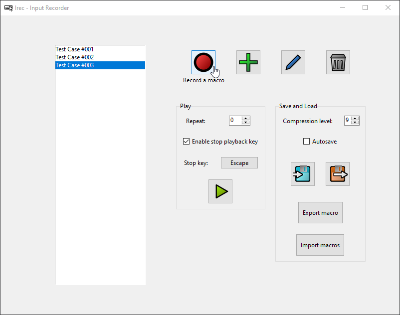
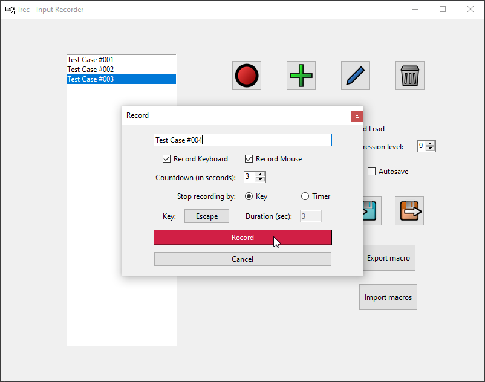
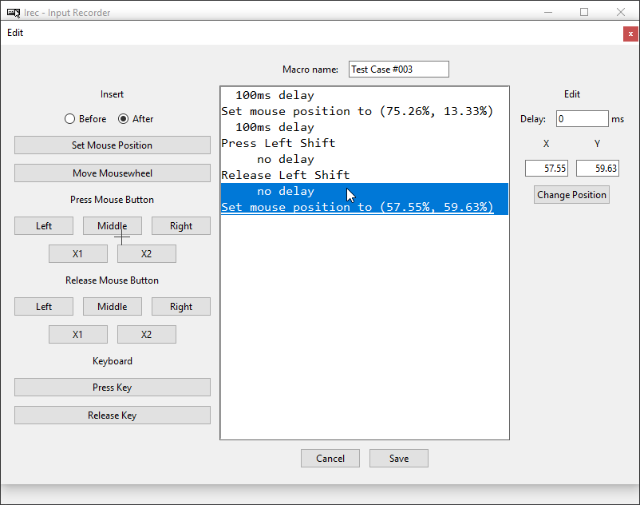

[//]: # (generated using SlashBack 0.2.0)

# Irec \- Input Recorder and Macro Suite  
**Record your keyboard and mouse inputs, store them as a macro and play them back at any time\!**  
  
  
  
**Windows only\.**  
**Python 3\.8 or greater recommended\.**  
  
## Features  
  
* **Record inputs** as macros  
    * **Mouse inputs**  
        * **Cursor** movement  
        * **Mousewheel movement** \(vertical and horizontal\)  
        * **Mouse button** events \(Left, Middle, Right, X1, X2\)  
    * **Keyboard inputs**  
        * **Key** events  
* **Play back macros**  
    * Once or **repeatedly**  
    * **Stop playback** by pressing a keyboard key  
    * Two playback options  
        * From the **GUI applicaion**  
        * Using a **dedicated player application** \(``` MacroPlayer.exe ```\)  
* **Edit macros**  
    * **Add inputs** to macros  
    * **Remove inputs** from macros  
    * **Change inputs**  
    * **Change delays** between inputs  
* **Create macros**  
* **Save and load macros**  
    * In **binary** format  
    * In **JSON** format  
* **Automatically save macros**  
* Irec is **Free Software** \(GNU General Public License 3\.0\)  
  
  
  
## Screenshots  
  
